# mc-print-3d

Convert Minecraft schematics into multi-color, print-ready 3D models, using the real block models and textures of your Minecraft installation and mods.

[](https://github.com/winchxyz/mc-print-3d/actions/workflows/tests.yml)
[](https://www.python.org/)
[](LICENSE)
[](#installation)
[](https://doc.qt.io/qtforpython-6/)
[](#supported-input-formats)

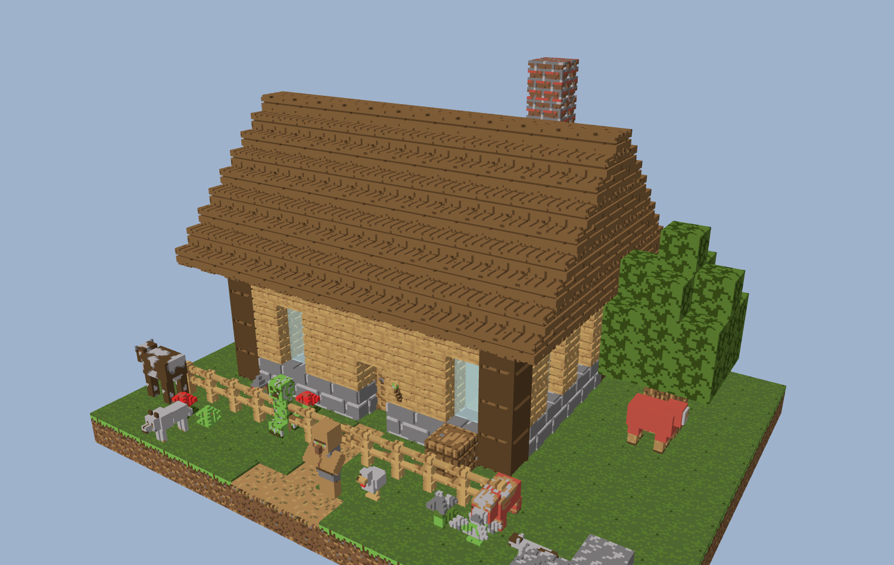

*A 17 × 11 × 13 block cottage with the creatures saved in its schematic, converted at 10 mm per block: texture relief on the walls and roof, the mobs as figures, every color from the game's own textures.*

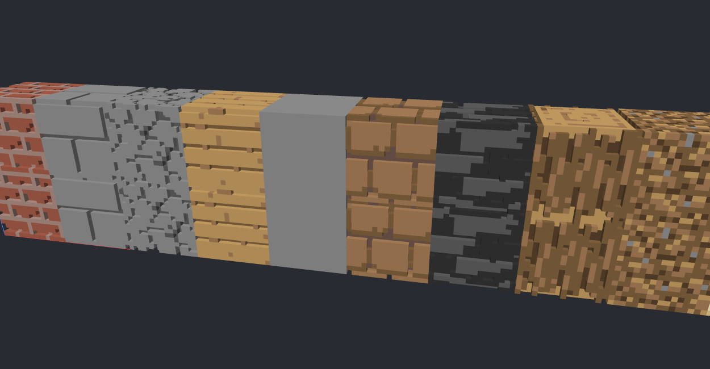

*Bricks, stone bricks, cobblestone, planks, stone, mud bricks, deepslate tiles, log, dirt, sandstone — converted at 16 voxels per block with 0.6 mm texture relief. Mortar lines, seams and bark ridges are real geometry; plain stone and dirt stay flat.*

## Why

Existing converters treat every block as a cube, or need a resource pack and a lot of manual cleanup. mc-print-3d reads the same JSON block models, blockstates and textures the game uses, so a stair is a stair, a fence is a fence, a flower is a cut-out plant, and a brick wall has mortar grooves. It then handles the printing side: minimum feature thickness, watertight per-color meshes, floating-fragment removal, bed fitting, filament matching, and talking to the printer.

## Features

**Input**
- MCEdit / Schematica `.schematic` (numeric ids, Minecraft 1.12 and older; full id table, Schematica mod mappings)
- Sponge / WorldEdit `.schem` v1, v2, v3
- Litematica `.litematic` (multi-region)
- Structure block `.nbt` (also Create/KubeJS ponder scenes and datapack structures)
- Bedrock `.mcstructure` (little-endian NBT, Bedrock block names translated to Java)
- Axiom `.bp` blueprints, and zipped schematics
- Block names from any version are modernized (1.13 → 1.21 renames), fence/wall/pane connections are inferred for legacy files

**Assets**
- Finds installations automatically: vanilla launcher, CurseForge, Prism / MultiMC / PolyMC, Modrinth App, ATLauncher
- Loads the vanilla jar, every mod jar of the chosen instance (including nested jar-in-jar libraries) and the enabled resource packs
- Resolves blockstates → variants / multipart → model parent chains → texture variables, exactly like the game
- Understands Forge / NeoForge `obj` and `composite` model loaders; chests (single and joined double chests), beds, shulker boxes and heads use the game's own ModelPart geometry and entity textures read from the client jar; signs, banners, conduits, decorated pots and bells get textured stand-in shapes, and the nether portal prints as a translucent slab.
- Mobs: creatures stored in the schematic are printed as figures from the game's own entity models (read out of the client jar) and skins; place more yourself, or print a single mob as a figure on a plate

**Geometry**
- Every block state is voxelized from its model elements at 2–32 sub-voxels per block (chosen automatically from block size and nozzle)
- Cut-out textures produce volume only where texels are opaque: flowers, grass, vines, iron bars, glass panes, ladders, rails
- Surface relief carved from texture pixels (real height maps from PBR packs, or pattern analysis of the color texture) on exposed faces only
- Thin elements are padded to a minimum printable thickness; thin texture features (flower stems, wires) are thickened
- Greedy meshing per color with T-junction repair; every material is a closed mesh on its own
- Floating fragment removal, cavity filling, base plate, cropping, rotation, bed-fit scaling and tiling

**Colors**
- Glass, stained glass, panes, ice, honey/slime and water are printed solid but kept as their own "clear filament" color: never merged with opaque blocks, matched to a clear/translucent filament when you have one, on their own plate in kit mode, semi-transparent in the preview and in 3MF/OBJ (alpha)
- Per-block (flat colors per block face) or per-texel coloring, reduced with weighted k-means in CIELAB
- Filaments you own: printer sync, slicer preset import, a 285-color catalog, or custom entries
- Best-subset selection for the slots you have and nearest-match assignment (CIEDE2000), editable per model color with a ΔE readout

**Printers**
| Backend | Discovery | Read from printer | Filament sync |
|---|---|---|---|
| Bambu Lab (LAN) | SSDP | model, firmware, state, nozzle | AMS trays and external spool (color, material, remaining) |
| Klipper / Moonraker | mDNS, subnet scan | bed from config, nozzle, extruders, state | Spoolman spools, Happy Hare MMU gates |
| OctoPrint | mDNS, subnet scan | printer profile (bed, nozzle, extruders), state | SpoolManager, FilamentManager |
| PrusaLink | mDNS, subnet scan | model, serial, nozzle, MMU | — (import PrusaSlicer presets) |
| Duet / RepRapFirmware | subnet scan | axes, tools, firmware | tool filament names |
| Elegoo (SDCP) | UDP broadcast | model, firmware | — |
| USB serial (Marlin…) | port listing | `M115` firmware/machine, `M211` limits | — |

Plus a database of 140+ printers with bed sizes and slot counts, and detection of installed slicers (Bambu Studio, OrcaSlicer, PrusaSlicer, Cura, Creality Print, Elegoo Slicer, QIDI Slicer) to open the export directly.

**Modes**
- Style: textured relief, flat smooth faces, or plain cubes
- Build: one solid model, or a modular kit of studded pieces with print plates, baseplate tiles and a layer-by-layer assembly guide

**Mobs**
- 78 vanilla mobs, from creeper to warden, with geometry extracted from the Minecraft client jar itself (`tools/extract_entity_models.py` runs the game's model code through a small bytecode interpreter) and the game's entity textures
- Entities saved in `.schem`, `.litematic`, `.nbt`, `.schematic` and `.mcstructure` files are placed automatically, with their rotation, sheep color, slime size and animal variants
- Extra mobs from the command line or the app, a plate under every figure on request, and `mcprint mob creeper` to print one mob on its own; in kit mode each mob becomes one figure piece on a socketed base tile

**Output**
- 3MF with one part per filament and base materials (any slicer)
- 3MF project for Bambu Studio / OrcaSlicer with filament slots pre-assigned
- STL per color, merged STL, OBJ + MTL
- Tiles that fit the bed, each exported separately

## Modes

**Style** (how surfaces look)

| Style | What you get | When to use |
|---|---|---|
| Textured | relief carved from the block textures on every exposed face | showcase pieces, 0.4 mm nozzle or finer |
| Flat | the real block shapes with smooth faces, no relief | any printer, fastest and most robust |
| Plain cubes | every block becomes a simple cube in its color | classic voxel look, huge builds |

**Build** (what comes out)

| Build | What you get |
|---|---|
| Single model | one multi-color object (or STL/OBJ), optionally tiled to the bed |
| Modular kit | every block as a separate piece with a stud on top and a socket underneath, printed flat on plates and assembled by hand like LEGO |

### Modular kit

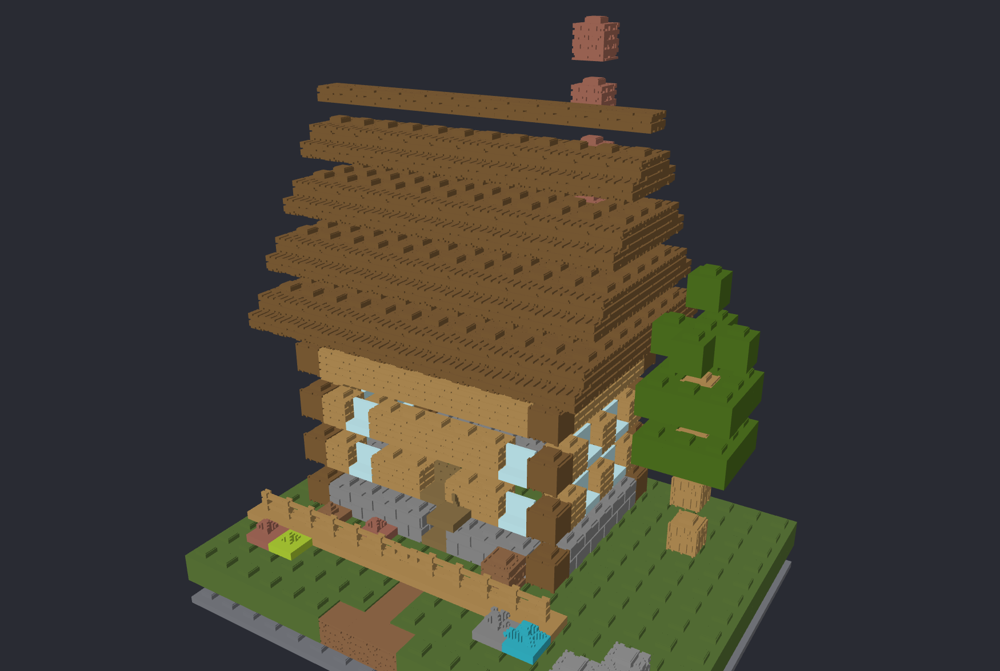

*The cottage as a kit, layers lifted apart: bars alternate direction every layer, every unit carries a stud, the first layer sits on a studded baseplate.*

| Pieces, textured, from above | The same pieces from below |
|---|---|
| 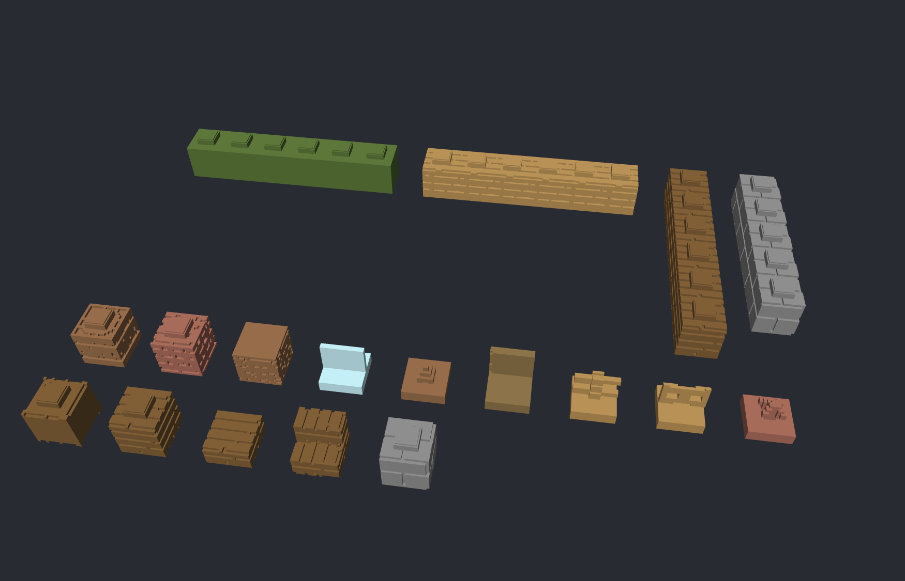 | 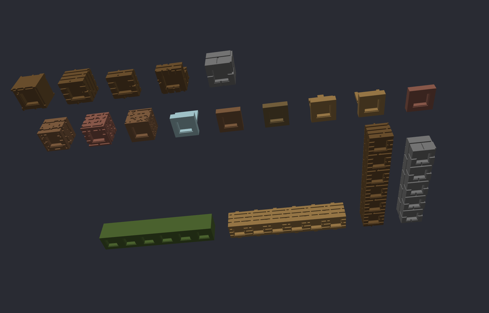 |

*Workbench, furnace, bookshelf, chest, closed and open trapdoor, torch, ladder, lantern, sign, glass, stairs, slab, fence, gate, pane, anvil, cake, campfire, barrel, stone bricks, bricks, log, grass, poppy, enchanting table, flower pot, brewing stand, door, sunflower, bed, tall grass, and 2×1 bars, each with its stud and socket.*

- One block = one unit (the block size). Studs are square, half a unit wide with a stepped chamfer; sockets have a configurable clearance (0.15 mm per side by default) and an entry chamfer.
- Runs of identical full-cube blocks merge into bars up to N units long, alternating direction every layer so walls interlock like brickwork.
- Stairs, slabs, fences, trapdoors, torches, ladders, flowers keep their geometry; thin pieces get a socketed base tile.
- Two-block objects become one piece: door halves and tall plants stack into a 2-unit-tall piece, a bed's foot and head merge into a 2-unit-long piece. The guide marks the cell above a tall piece so nothing else is placed there.
- Output folder: `pieces/` (one STL per piece type, quantity in the file name), `plates/` (3MF plates with every copy arranged on your bed, one filament per plate), studded baseplate tiles, `parts.csv`, and `assembly_guide.html` with a colored top-down map for every layer.

```bash
python -m mcprint convert castle.litematic --kit --block-mm 10 --kit-fit 0.15 --bed 330x320x325
python -m mcprint convert castle.litematic --style flat            # smooth faces, no relief
python -m mcprint convert castle.litematic --style cubes           # plain cubes
```

## Mobs

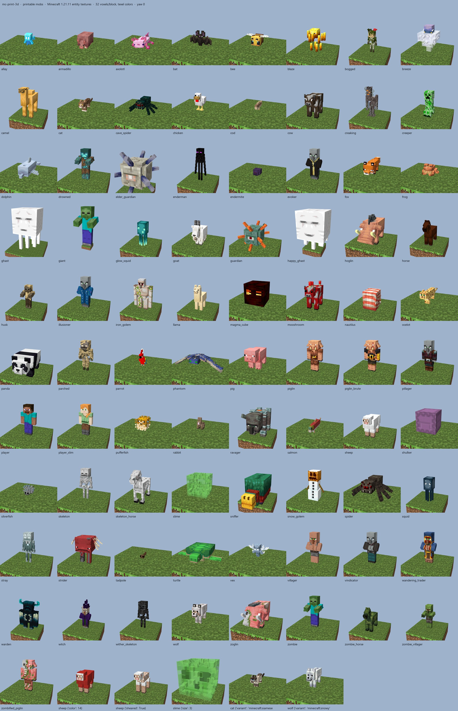

*All 78 printable mobs rasterized at 32 voxels per block from the 1.21.11 entity textures, plus a red sheep, a sheared sheep, a size-3 slime, a siamese cat and a snowy wolf. Hostile: blaze, bogged, breeze, cave spider, creaking, creeper, drowned, elder guardian, enderman, endermite, evoker, ghast, giant, guardian, hoglin, husk, illusioner, magma cube, parched, phantom, piglin, piglin brute, pillager, ravager, shulker, silverfish, skeleton, slime, spider, stray, strider, vex, vindicator, warden, witch, wither skeleton, zoglin, zombie, zombie villager, zombified piglin. Friendly: allay, armadillo, axolotl, bat, bee, camel, cat, chicken, cod, cow, dolphin, fox, frog, glow squid, goat, happy ghast, horse, iron golem, llama, mooshroom, nautilus, ocelot, panda, parrot, pig, players (Steve and Alex, or your own skin), pufferfish, rabbit, salmon, sheep, skeleton horse, sniffer, snow golem, squid, tadpole, turtle, villager, wandering trader, wolf, zombie horse.*

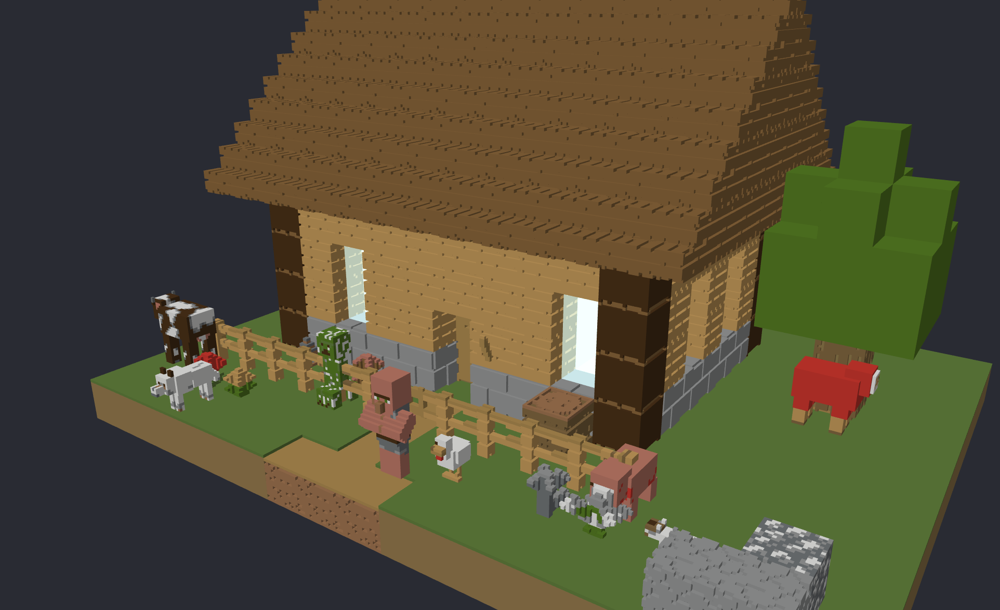

*A `.litematic` with eight entities in the yard, converted as one 16-color model. Left to right: cow, wolf, creeper, villager, chicken, cat, pig, and a red sheep by the tree.*

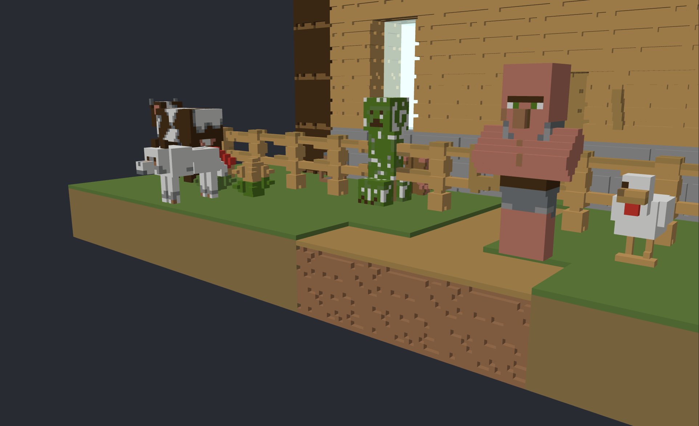

The geometry is not modelled by hand. Minecraft keeps its entity models in code (`CreeperModel.createBodyLayer()` and friends), so `tools/extract_entity_models.py` runs that code from the client jar through a small JVM bytecode interpreter, using Mojang's published mappings to find the classes, and writes every `LayerDefinition` to `mcprint/mobs/vanilla_models.json`: each box with its `texOffs`, mirror flag and `CubeDeformation`, the `PartPose` offsets and rotations, the texture size the model was authored for, and the render scale (cave spider 0.7, wither skeleton 1.2, ghast 4.5). The same tool regenerates the file for any version. The rasterizer then reproduces the renderer: the `scale(-1, -1, 1)` mirror, the `180 − yaw` turn, and each sub-voxel inside a box colored from the atlas face it is closest to, so skins map onto the figure exactly. Poses are not guessed either: `tools/extract_entity_poses.py` builds each model class the way the game does and runs its `setupAnim` with an idle render state (standing still on the ground, age zero) through the same interpreter, then records what moved: zombie arms forward, piglin ears drooping, an axolotl lying flat with splayed legs, illagers with crossed arms, a turtle without its egg belly. What is left by hand in `mcprint/mobs/models.py` is the texture each renderer uses and stacked layers (sheep wool, the slime's translucent outer cube, the breeze's wind funnel). Skin overlays (hats, jackets, sleeves) are baked onto the body instead of printed as paper-thin shells; enderman eyes, the snow golem's pumpkin block and the mooshroom's mushrooms are extra layers.

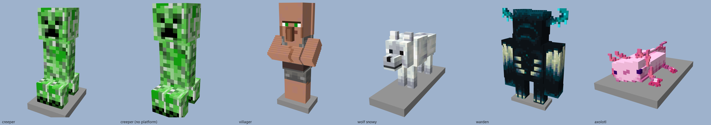

*`mcprint mob` prints one mob as a figure: creeper with and without its plate, villager, snowy wolf, warden, axolotl, at 16 mm per block.*

- **From the schematic.** Entities are read from Sponge v2/v3, Litematica regions, structure files, MCEdit (`WEOrigin` aware) and `.mcstructure`. Position, yaw, sheep `Color`/`Sheared`, slime `Size` and `variant` tags are used; unsupported entity types (item frames, minecarts, mobs without a model yet) are listed as warnings.
- **Placed by hand.** `--mob ID@X,Y,Z[,YAW]` in block coordinates (feet centre, relative to the schematic), repeatable; `sheep:red@…`, `slime:3@…`, `pig:cold@…`, `wolf:snowy@…`, `cat:siamese@…` pick variants; `--skin steve.png` uses your own 64×64 skin for `player` / `player_slim`; `--mob-scale 2` makes every mob twice the size; `--no-mobs` ignores schematic entities. The app has the same controls on the Schematic tab.
- **Plates.** `--mob-platform` (or the checkbox in the app) puts a 2 mm plate under every mob in a solid build, sized to the figure's footprint, so it stands on its own. Kit pieces always get a socketed base tile that clicks onto the studded baseplate.
- **One mob, one file.** `mcprint mob creeper --block-mm 20` writes a creeper figure with its plate; `mcprint mob sheep:red --kit` a red sheep as a kit piece; `mcprint mob player --skin me.png --format stl` you.
- **Kit mode.** A mob is one piece: all of its cells as a single body on a base tile with a socket under every ground cell (no studs on a head). Figures print in their dominant color; use the solid build for full-color mobs.
- **Rotation.** Entity yaws are snapped to the nearest 90° by default so a figure's boxes align with the voxel grid; a mob turned 37° would print as stair-steps on every face. `--mob-free-yaw` (or the checkbox in the app) keeps the exact rotation.
- **Detail.** `mcprint mob` uses up to 32 voxels per block, which small mobs need: a cat is drawn at 0.8 scale and a rabbit at 0.6, so their ears and noses are under a voxel wide at 16. In a schematic, mobs share the block resolution (16 sub-voxels per block by default), so a 4-unit-wide arm is 4 voxels wide and tilted parts (villager arms, spider legs, wolf tail) come out stair-stepped like any diagonal in a voxel model. Set *resolution* to 32 in the Model tab or pass `--resolution 32` for finer figures at the cost of larger meshes.

```bash
python -m mcprint mobs                                                    # list ids, sizes, textures
python -m mcprint mob creeper --block-mm 20 -o creeper.3mf                # one figure on a plate
python -m mcprint mob warden --block-mm 12 --format stl --no-platform
python -m mcprint convert village.litematic --mob creeper@5,1,7,90 --mob sheep:red@2,1,2 --mob-platform
python -m mcprint convert base.schem --mob player@3,1,3 --skin my_skin.png --mob-scale 1.5
```

| Kit figures from above | The same figures from below |
|---|---|
| 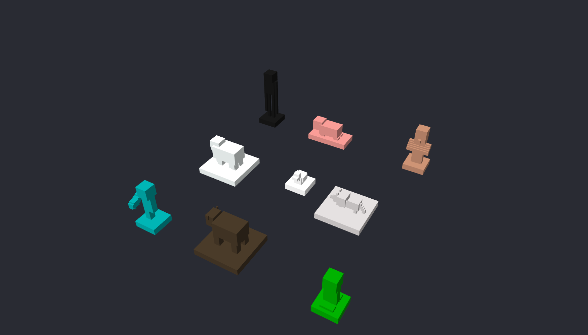 | 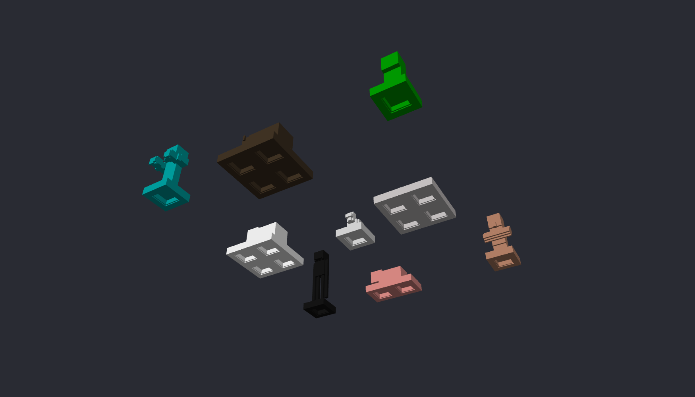 |

*Enderman, pig, villager, sheep, chicken, wolf, zombie, cow and creeper as single-color kit pieces, each on a base tile with one socket per ground cell.*

## Block catalog

Every block state of Minecraft 1.21.11 (1,026 of them) rendered through the converter at 16 voxels per block with texel colors and 0.6 mm relief, from the game's own models and textures. Full sheets: [1](docs/catalog/blocks-1.jpg) · [2](docs/catalog/blocks-2.jpg) · [3](docs/catalog/blocks-3.jpg) · [4](docs/catalog/blocks-4.jpg).

[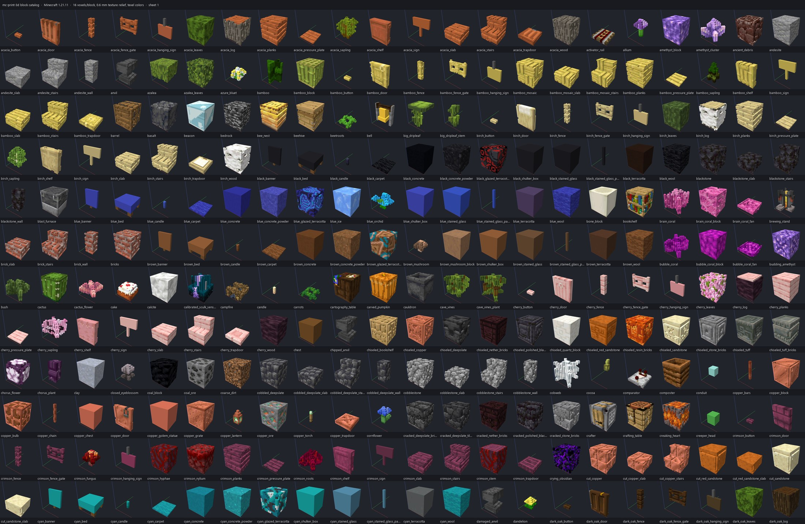](docs/catalog/blocks-1.jpg)

Blocks the game draws with block-entity renderers have no JSON geometry. Chests (single, double, trapped, ender, copper in every oxidation state) and beds are rebuilt from their entity atlases with the same boxes and UV layout the renderer uses, so the lid rim, latch, pillow, blanket and legs come out like in the game; signs, banners, heads, shulker boxes and conduits are shaped boxes in their real colors.

[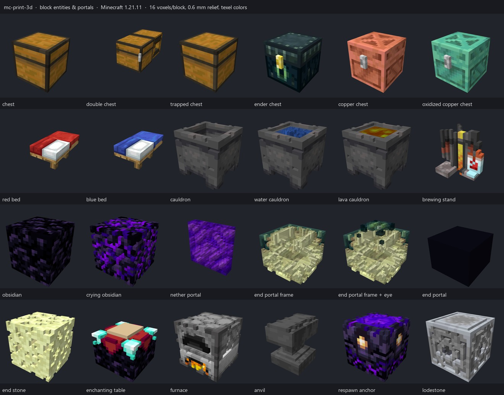](docs/catalog/block-entities.jpg)

*Chests, beds, cauldrons (empty, water, lava), brewing stand with bottles, obsidian, crying obsidian, the nether portal as a translucent slab, end portal frame with and without its eye, end portal, end stone, enchanting table, furnace, anvil, respawn anchor and lodestone.*

## Screenshots

| Desktop app | Model colors → filaments |
|---|---|
| 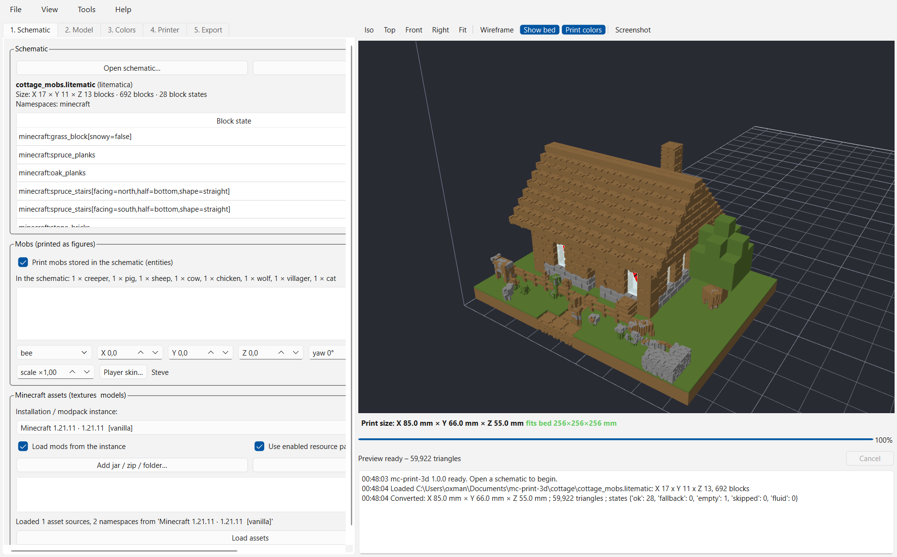 | 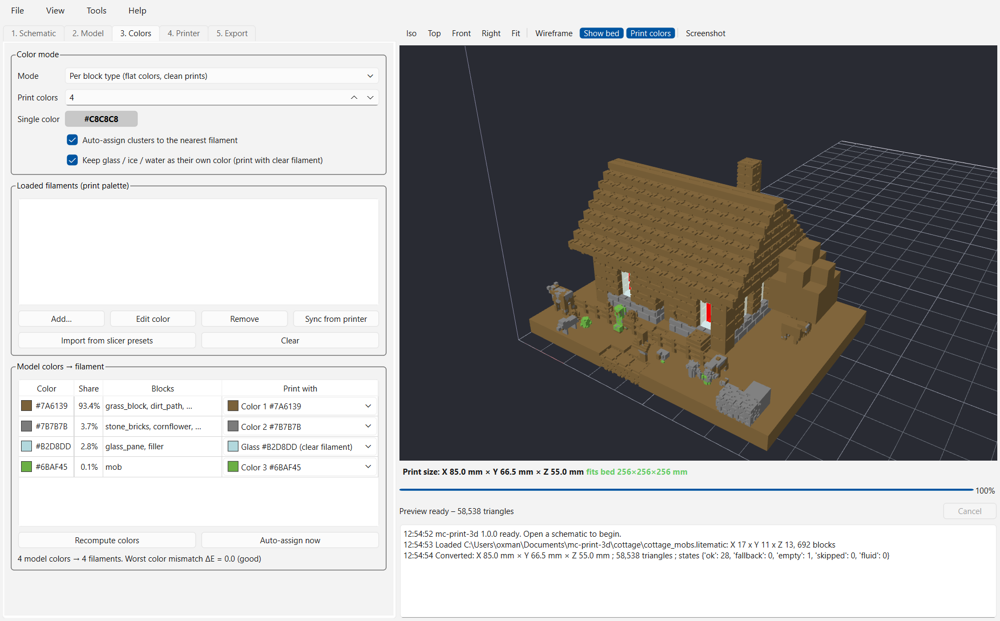 |

## Installation

Requires Python 3.10 or newer.

```bash
git clone https://github.com/winchxyz/mc-print-3d.git
cd mc-print-3d
python -m venv .venv
.venv\Scripts\pip install -r requirements.txt      # Windows
# .venv/bin/pip install -r requirements.txt       # macOS / Linux
```

Core dependencies: `numpy`, `Pillow`, `requests`. Optional: `PySide6` (desktop app), `pyserial`, `zeroconf`, `paho-mqtt` (printer integrations). `run.bat` / `run.sh` create the environment on first use and start the app.

## Usage

Desktop app:

```bash
python -m mcprint gui
```

Command line:

```bash
# 4 mm blocks, 4 print colors, multi-part 3MF
python -m mcprint convert castle.litematic -o out/castle.3mf --block-mm 4 --colors 4

# scale to 180 mm, map colors to the filaments you have, Bambu Studio project with slots assigned
python -m mcprint convert house.schem --target-size 180 \
    --filaments "#FFFFFF,#000000,#C12E1F,#0A2989" --format 3mf-bambu

# modded build: take assets from a CurseForge instance, include water, STL per color
python -m mcprint convert base.schematic --instance "All the Mods 10 - ATM10" --fluids --format stl

# deeper texture relief, per-texel colors, split into tiles for a 256 mm bed
python -m mcprint convert cathedral.schem --relief 0.8 --color-mode texel --bed 256x256x256 --split

python -m mcprint info castle.litematic          # contents, block counts, namespaces
python -m mcprint instances                      # Minecraft installations found
python -m mcprint printers --scan --save         # USB + network discovery
python -m mcprint filaments --sync bambu:<serial>  # read the AMS
python -m mcprint filaments --import-slicer      # Bambu Studio / OrcaSlicer / PrusaSlicer presets
```

`python -m mcprint convert --help` lists every option; the same settings are exposed in the app.

## Workflow

1. **Schematic** – open or drop a file. The instance whose mods match the file's namespaces is selected automatically; extra jars or resource packs can be added.
2. **Model** – block size, target size or bed fit; resolution; minimum feature thickness; texture relief depth; fluids, island removal, cavity filling, base plate. *Convert* builds the preview.
3. **Colors** – per-block or per-texel; number of print colors; load the filaments you own (sync from the printer, slicer presets, catalog, custom) and assign one to each model color.
4. **Printer** – scan USB and network or pick a database entry; bed, nozzle and slot count feed the model and export settings.
5. **Export** – choose the format, optionally tile to the bed, open in the detected slicer.

## How geometry is built

- **Models to voxels.** Each block state resolves to model elements (rotated cuboids with per-face textures). Sub-voxel centres are tested against every element; the texel of the nearest face gives the color and, through its alpha, whether the voxel exists at all.
- **Texture relief.** For every texture a recess map is built: from `_h.png` / LabPBR `_n.png` height data when a resource pack ships it, otherwise from the color texture itself (local-contrast outliers that form connected, line-like structures – mortar, seams, cracks). The recess is carved only under faces that are actually exposed, so adjacent blocks never develop hidden channels. Depth is set in millimetres; auto resolution guarantees at least one voxel of relief.
- **Printability.** Elements thinner than the minimum thickness are padded; cut-out features are dilated by a texel; blocks not connected to the main body are dropped; enclosed rooms can be filled; a base plate can be added.
- **Meshing.** A chunked greedy mesher emits closed per-material meshes (faces wherever a material meets anything else) and repairs T-junctions, so slicers receive manifold parts.

Print space: Minecraft X → X, Minecraft Z (south) → −Y, Minecraft Y (up) → Z. Dimensions are always reported as X × Y × Z in millimetres.

## Supported input formats

| Format | Extension | Notes |
|---|---|---|
| MCEdit / Schematica / old WorldEdit | `.schematic` | numeric ids + metadata, `AddBlocks`, `SchematicaMapping` for mod blocks |
| Sponge / WorldEdit 7+ / FAWE | `.schem` | versions 1–3, varint block data, palette states, entities |
| Litematica | `.litematic` | all regions merged, tightly packed bit arrays, entities per region |
| Structure block | `.nbt` | palette + block list + entities; ponder scenes, datapacks |
| Bedrock Edition | `.mcstructure` | little-endian NBT, block name and state translation, entities |
| Axiom | `.bp` | header + 16³ paletted sections |
| Archive | `.zip` | first schematic inside |

## Architecture

| Module | Responsibility |
|---|---|
| `mcprint/nbt.py` | NBT reader/writer (Java and Bedrock byte order, packed arrays, varints) |
| `mcprint/schematics/` | format loaders, legacy id table, block renames, Bedrock name mapping |
| `mcprint/assets/` | installation discovery, jar/mod/pack stack, blockstate/model/texture resolution, tints, fallbacks, OBJ models |
| `mcprint/voxel/` | voxelizer, texture relief, chunked grid, block-level cleanup, greedy mesher, connection inference |
| `mcprint/mobs/` | entity geometry extracted from the client jar (`vanilla_models.json`), per-mob textures/layers/poses, rasterizer, placement into the voxel grid |
| `tools/extract_entity_models.py` | JVM bytecode interpreter for the game's model code: regenerates `vanilla_models.json` from any client jar + Mojang mappings |
| `tools/extract_entity_poses.py` | runs each model's `setupAnim` in an idle state through that interpreter and writes `vanilla_poses.json` |
| `mcprint/color/` | k-means / filament assignment, filament library, catalog, slicer preset import |
| `mcprint/export/` | STL, OBJ, 3MF writers, bed tiling |
| `mcprint/printers/` | printer database, backends, discovery, profiles, slicer detection |
| `mcprint/pipeline.py` | conversion driver shared by CLI and GUI |
| `mcprint/gui/` | PySide6 application with OpenGL preview |

## Development

```bash
.venv\Scripts\python -m pytest -q
```

The suite (279 tests) covers NBT, every loader, the resolver, voxelizer, relief, mesher, mobs, kit, exporters, quantizer and printer backends with mocked HTTP. Tests that need a real client jar are skipped when none is installed.

## Limitations

- Bambu Lab AMS reading needs the printer's LAN access code and, on recent firmware, Developer/LAN mode. If Bambu Studio is running it may hold the discovery port; enter IP and serial manually then.
- Texture relief is inferred for textures without height maps; a pattern that the analysis does not recognise as line-like stays flat (mode `dark` or `light` forces it).
- Mod blocks rendered entirely in code (no JSON model, no OBJ) are approximated by a cube colored from their particle texture.
- Mobs are printed in their rest pose (zombie arms forward, villager arms crossed); baby mobs print at adult size. Mobs whose shape only exists at runtime (the ender dragon's neck and tail segments, the wither, copper golems) are not included.
- The Bambu-flavoured 3MF project metadata is a best effort; the plain 3MF is the safe route for any slicer.

## License

[MIT](LICENSE)
